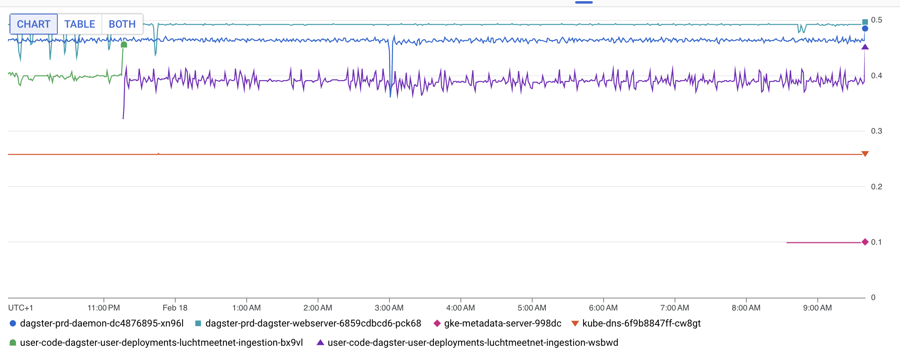
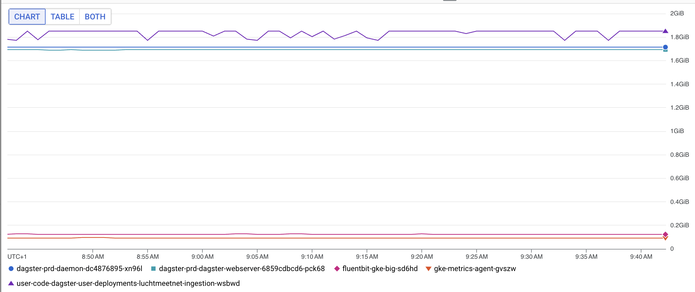
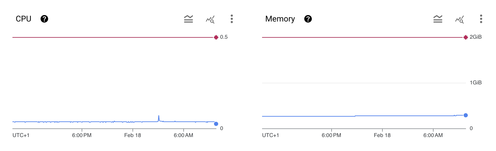
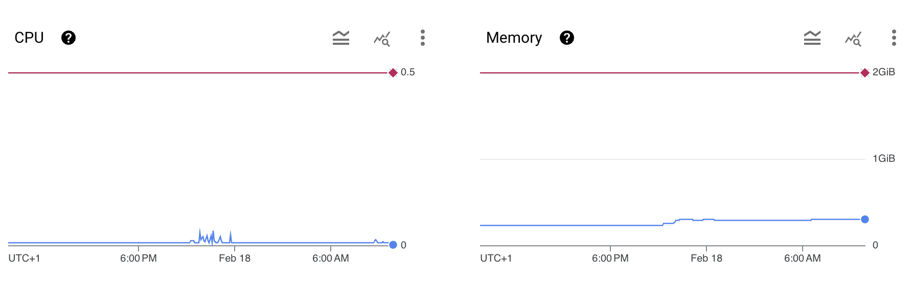
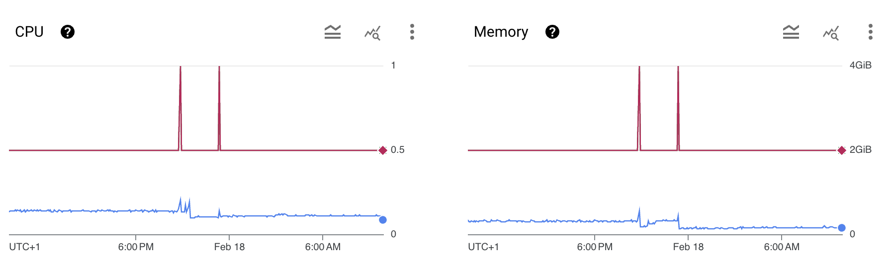

## 📜 Table of contents
---
```table-of-contents
```
## ✍️ Context
---
To reduce spending on the dagster deployment on GKE, we should limit the resources allocated for the long-running services. These services are:
- Dagster webserver
- Dagster daemon
- Dagster code locations
The resource limits can be set on the [dagster helm chart values.yml](https://github.com/dagster-io/dagster/blob/master/helm/dagster/values.yaml).

### Current resource requests
Looking at the pod deployments, we see that the following resource requests and limits are set for the webserver, daemon, and code location:

```text
Limits:
  cpu:                500m
  ephemeral-storage:  1Gi
  memory:             2Gi
Requests:
  cpu:                500m
  ephemeral-storage:  1Gi
  memory:             2Gi
```

Currently, all three Dagster services have unused resources

**CPU** (ranked in terms of unused resources)
1. Webserver
2. Daemon
3. Code location


**Memory** (ranked in terms of unused resources)
1. Code location
2. Daemon
3. Webserver


Requested versus used resource requests (from GKE workload overview, 24 hour window)

**Daemon**


**Webserver**


**Code location**


## 🤝 Decision
---
Set the resource constraints as follows:

**Daemon**
```text
Limits:
  cpu:                200m
  ephemeral-storage:  1Gi
  memory:             400Mi
Requests:
  cpu:                200m
  ephemeral-storage:  1Gi
  memory:             400Mi
```

**Webserver**
```text
Limits:
  cpu:                120m
  ephemeral-storage:  1Gi
  memory:             400Mi
Requests:
  cpu:                120m
  ephemeral-storage:  1Gi
  memory:             400Mi
```

**Code location**
```text
Limits:
  cpu:                250m
  ephemeral-storage:  1Gi
  memory:             400Mi
Requests:
  cpu:                250m
  ephemeral-storage:  1Gi
  memory:             400Mi
```

## ☝️Consequences
---
- Saves money

**Harder**:
- need to start monitoring resources and send out alerts in case resources are too tightly specified.
- We have split the code locations from the webserver and daemon, and need to specify the resource requests/limits in two places.
	- In dagster-infra, this is done using Terraform
	- In dagster-dags, we have to fill in the values directly in values.yaml

## 🔗 References
---
- [[🎚️ Limiting resource requests and limits on the Dagster webserver and daemon]]
