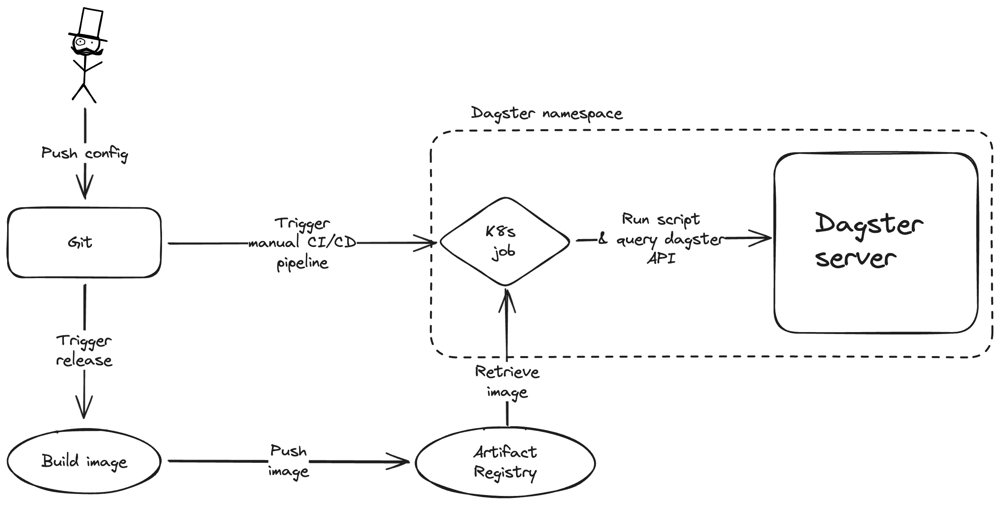

## ✍️ Context
---
We want to run one-time production jobs without actually touching prod or doing any manual work (i.e. clickops). Preferably, we also log these kinds of actions taken by specifying a configuration file and storing these in git. This will serve as an audit log and documentation.

## 🤝 Decision
---
Create a new library called "dagster_scripts", which contains a CLI for one-time production jobs. Commands can be added to this CLI (e.g. different kinds of one-time production jobs).
1. Each of the commands should take as its input a configuration file.
2. The configuration file should be written in YAML.
3. The configuration file should use type-checking using Pydantic.
4. The CLI is packaged using docker and made available upon release and push to main.
5. To actually run a manual production job, we create a CI/CD pipeline that needs to be manually triggered. The design of this pipeline is subject of another ADR.
6. The CI/CD pipeline triggers a kubernetes job, which pulls the docker image containing the CLI and runs the desired command.
7. The kubernetes job template will be added to the repo, and should be templated to allow for CLI version specification.
   

## ☝️ Consequences
---
Harder:
- Quickly running backfills. These should not be executed using the Dagster UI, but through a PR, which adds overhead.
- People need to know the way that a configuration is specified.
- Adding new commands can be cumbersome because these need to be written in Python and it's essentially another python library.

Easier:
- Tracing manual production jobs and their settings.
- History of manual production jobs executed over time.
- Everything is declared in code.
