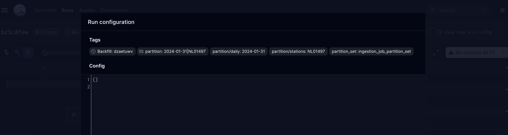

- [[#🤓 TL;DR;|🤓 TL;DR;]]
- [[#🔭 Context and Scope|🔭 Context and Scope]]
- [[#🎯 Goals (and Non-Goals)|🎯 Goals (and Non-Goals)]]
- [[#🦉 The Actual Design|🦉 The Actual Design]]
	- [[#🦉 The Actual Design#🤙 Calling the Dagster GraphQL endpoint|🤙 Calling the Dagster GraphQL endpoint]]
	- [[#🦉 The Actual Design#🗄️ Library setup and organization|🗄️ Library setup and organization]]
	- [[#🦉 The Actual Design#📝 Configuration file and configuration schema validation|📝 Configuration file and configuration schema validation]]
- [[#🌈 Alternatives considered|🌈 Alternatives considered]]
- [[#🤝 Final decision|🤝 Final decision]]
- [[#☝️ Follow-ups|☝️ Follow-ups]]

## 🤓 TL;DR;
---
We want to be able to call the API to trigger job runs rather than doing this manually from the UI so that we can run e.g. backfills from CI/CD using configs so that we have these checked into git. In short: create a python library with commands for common jobs (e.g. backfill) that each take a configuration file.

## 🔭 Context and Scope
---
To do this, we need to do two things:
1. Show that we can call the Dagster API to trigger a Job.
2. Define a configuration format that allows user to specify a backfill job. The configuration location should be passed to a CLI command.

Out of scope:
1. Actual production-ready implementation of any of the above.
2. Ensure that we can call the API in the deployment environment (GKE) and have access to the correct endpoint.
3. Define some constraints / rules on the CLI and Kubernetes job so that we can trigger it from a CI/CD pipeline.
4. Triggering endpoints in the GraphQL API that are not yet defined as a method in the python client.
5. Configuration versioning and dealing with schema evolution.

## 🎯 Goals (and Non-Goals)
---
**Goals**
- Define common API for one-time script commands, so that only one CI/CD pipeline has to be created that can take the script name as input.
- Ensure that we can call the Dagster GraphQL API to trigger the job and follow it to completion.
- Investigate async polling of jobs until completion.

**Non-goals**
- Worry about how we can access the GraphQL endpoint for production system in GKE.

## 🦉 The Actual Design
---
### 🤙 Calling the Dagster GraphQL endpoint
Dagster has a [GraphQL API](https://docs.dagster.io/concepts/webserver/graphql#graphql-api) that you can use to e.g. trigger jobs. There's also a [GraphQL Python Client](https://docs.dagster.io/concepts/webserver/graphql-client) with limited functionality.

> [!important]
> The GraphQL API is still evolving and is subject to breaking changes. A large portion of the API is primarily for internal use by the Dagster webserver. For any of the queries below, we will be clear about breaking changes in release notes.

You can connect to the client like so:
```python
from dagster_graphql import DagsterGraphQLClient, DagsterGraphQLClientError

# Function: with dagster client (decorator)
# Function: with poll until completion (decorator)
#  client.get_run_status(new_run_id)
client = DagsterGraphQLClient("localhost", port_number=3000)
```
The client has several methods, the most important of which are `submit_job_execution` and `get_run_status`.

To submit a job execution request for a partitioned asset, you must pass tags with partition details. These can be inferred from the UI. Click on Runs > Run ID > View tags a config

The partitions need to be prefixed with "dagster", so e.g. "dagster/partition/stations: NL01497". You can then run
```python
def request_run(client: DagsterGraphQLClient, tags: typing.Dict[str, str]):
    try:
        new_run_id: str = client.submit_job_execution(
            job_name="ingestion_job",
            repository_name="luchtmeetnet_ingestion",
            run_config={},
            tags=tags
        )
        return new_run_id
    except DagsterGraphQLClientError as e:
        print(e)

run_id = request_run(client, {
	'dagster/backfill': '#issuenumber'
	'dagster/partition/daily': '2024-01-31',
	'dagster/partition/stations': 'NL01497'
})

client.get_run_status(run_id)
```
There is a `partitionSetsQuery` endpoint on the GraphQL API that we can use to validate the partitions. It's not trivial to call this without knowing how to structure the query.
### 🗄️ Library setup and organization
We create an additional library in the "dagster-dags" monorepo. This library is called "dagster_scripts". It contains:
- A typer CLI, defined in "cli.py".
- For each script, we define
	- a command that takes as its input a "config" parameter, defined in "commands.py"
	- The command will be registered as a CLI command that should take as an input a path to a configuration file.
    These are separated so that we can easily test the command without having to invoke a CLI test wrapper.
```python
# commands.py
from dagster_scripts.configuration import BackfillConfiguration

def backfill(conf: BackfillConfiguration):
	...

# cli.py
import .commands
import .configuration
import typer

app = typer.Typer(
	help="🧰 Command-line tools for running one-time dagster production jobs.",
	no_args_is_help=True,
)

@app.command(
	name="backfill",
	help="Runs a backfill job from a configuration file",
	no_args_is_help=True,
)
def _backfill(
	path_to_config: str = typer.Argument(
		None,
		help="Path to a config file."
	)
):
	conf: configuration.BackfillConfiguration = utils.read_configuration()
	commands.backfill(conf)
```
- The function `dagster_scripts.commands.backfill` will contain the actual logic for running a backfill job.

### 📝 Configuration file and configuration schema validation
- We use [pydantic](https://docs.pydantic.dev/latest/) for loading the configuration and schema validation.
- All configuration files inherit from `pydantic.BaseModel`, so we can use a utility function to load the configuration from disk like so:
```python
import typing
import pathlib as plb

import yaml
from pydantic import BaseModel


def load_config(path: typing.Union[str, plb.Path], config_cls: BaseModel) -> BaseModel:
	"""Load a YAML configuration file from disk"""
	path = plb.Path(path).resolve()
	if not path.exists():
		raise FileNotFoundError(f"Config at '{path}' not found")
	with path.resolve().open("r") as inFile:
		cnf_raw = yaml.safe_load(inFile)
		cnf_out = config_cls(**cnf_raw)
		return cnf_out
```
- The following pydantic classes define a flexible model schema that we can use for e.g. static and date partitioned assets:
```python
import typing
import datetime as dt

import pendulum
from pydantic import BaseModel


class DateBackfillPartitionConfig(BaseModel):
	name: str
	start_date: dt.date
	end_date: dt.date

	def get_range(self):
		return pendulum.period(self.start_date, self.end_date).range('days')

	def config_dict(self):
		return [{f"dagster/partition/{self.name}": d.to_date_string()} for d in self.get_range()]


class StaticBackfillPartitionConfig(BaseModel):
	name: str
	values: typing.List[str]

	def config_dict(self):
		return [{f"dagster/partition/{self.name}": v} for v in self.values]


class BackfillTagsConfig(BaseModel):
	name: str
	partitions: typing.List[typing.Union[StaticBackfillPartitionConfig, DateBackfillPartitionConfig]]


class BackfillConfig(BaseModel):
	job_name: str
	repository_name: str
	tags: BackfillTagsConfig
```
- This schema works for configuration files that look like this:
```yaml
# Backfill configuration file backfill.yaml
job_name: ingestion_job # Dagster job name
repository_name: luchtmeetnet_ingestion # Dagster DAG name
tags:
	name: '#issue1234' # Issue number, ticket number etc.
	partitions:
	- name: daily # Should be the same as the partition name
	  start_date: '2024-01-01'
	  end_date: '2024-02-01'
	- name: stations # Same as partition name
	  values:
	  - NL01497
	  - NL01912
```
- Because we expect the classes `DateBackfillPartitionConfig` and `StaticBackfillPartitionConfig` to have the `config_dict()` method, we can retrieve the unique product of all partition combinations (irrespective of how many partitions we actually have defined) like this:
```python
import itertools

import collections

cnf = {
    "job_name": "ingestion_job",
    "repository_name": "luchtmeetnet_ingestion",
    "tags": {
        "name": "hollowtest",
        "partitions": [
            {
                "name": "daily",
                "start_date": "2024-01-31",
                "end_date": "2024-02-01"
            },
            {
                "name": "stations",
                "values": ["NL01497", "NL01912"]
            }
        ]
    }
}

conf_dict = BackfillConfig(**cnf)

conf_dicts = [
    dict(collections.ChainMap(*cnf_parsed))
    for cnf_parsed in
    itertools.product(
        *[
            partition.config_dict()
            for partition in conf_dict.tags.partitions
        ]
    )
]

# Conf dict looks like this:
'''
[{'dagster/partition/stations': 'NL01497', 'dagster/partition/daily': '2024-01-31'}, {'dagster/partition/stations': 'NL01912', 'dagster/partition/daily': '2024-01-31'}, {'dagster/partition/stations': 'NL01497', 'dagster/partition/daily': '2024-02-01'}, {'dagster/partition/stations': 'NL01912', 'dagster/partition/daily': '2024-02-01'}]
'''
```

## 🌈 Alternatives considered
---

|  | Option 1 | Option 2 |
| ---- | ---- | ---- |
| Overview | Use a python library with a CLI | Use one-off scripts, maybe with a wrapper function to call scripts |
| Pros | - Well-documented approach. <br>- Reusable components.<br>- Easy to extend when all set up<br>- Just a library so all good things of libraries included (e.g. python tests).<br>- Single entrypoint using a single language.<br>- Well-defined configuration | - Flexible and quick to set up<br>- Can use a mix of shell / python where necessary |
| Cons | - Overhead, overhead, overhead<br>- Not so easy to extend if you don't know the structure yet. Need to read README.  | - No testing<br>- Can become messy in organization.<br>- Harder to have well-defined configuration and schema checking<br>- Harder to re-use components. |
Basically we considered two options:
1. Allow scripts to be defined in whatever language, and have a wrapper CLI that forms the entrypoint to these scripts (possibly set when triggering CI/CD).
2. Create a python package with a CLI and some rules for adding commands to the CLI. Every command is a "script" or production job and should take a configuration that is loaded using pydantic.

Option (2) has preference because it allows us to build a "golden path" for running one-time production jobs and ensuring that we use a predictible, similar API for creating configurations and CLI commands. This will help when we are designing the CI/CD pipeline that triggers a CLI command.

## 🤝 Final decision
---
We will implement the above as a python library so that we can trigger Dagster jobs manually using the API.

## ☝️ Follow-ups
---
- Write RFC about how we will execute a CLI command with a configuration on the GKE cluster.
- Write RFC about what the CI/CD job will look like that triggers the job on the GKE server.
