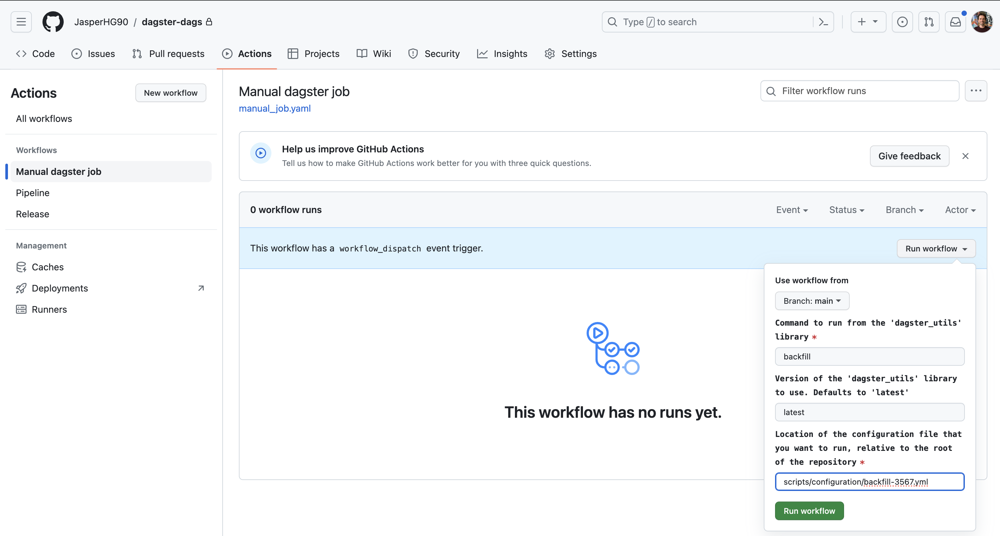

- [[#🤓 TL;DR;|🤓 TL;DR;]]
- [[#🔭 Context and Scope|🔭 Context and Scope]]
- [[#🎯 Goals (and Non-Goals)|🎯 Goals (and Non-Goals)]]
- [[#🦉 The Actual Design|🦉 The Actual Design]]
	- [[#🦉 The Actual Design#🐈 GitHub Actions pipeline|🐈 GitHub Actions pipeline]]
- [[#🤝 Final decision|🤝 Final decision]]
- [[#☝️ Follow-ups|☝️ Follow-ups]]
- [[#🔗 Related|🔗 Related]]

## 🤓 TL;DR;
---
In [[💪 Executing manually triggered Dagster jobs within GKE]] we described a way to execute manual Dagster jobs by templating a Kubernetes job spec. In this RFC we propose a design for the GitHub Actions pipeline that will allow a user to execute a manual job (e.g. a backfill) on the Dagster server hosted on GKE.

## 🔭 Context and Scope
---
We want to define a CI/CD pipeline that allows us to trigger a Dagster job (e.g. a backfill) from a configuration. This has been described in [[🔘 Manually triggering jobs on the Dagster GKE production server using a configuration file]]. To trigger the job, we want to generate a Kubernetes job spec and apply it using `kubectl apply`. This has been described in [[💪 Executing manually triggered Dagster jobs within GKE]].

The scope of this RFC is to define how we want to set up the GitHub action that:
- Templates the kubernetes job spec
- Executes a job
- Uploads the job spec as a pipeline artifact

Out of scope:
- Alerting if a pipeline fails
- Tracing a job until completion
- Implementing various checks

## 🎯 Goals (and Non-Goals)
---
**Goals**:
- Allow users to kick-off a dagster job by using a GitHub actions pipeline and a configuration file.

## 🦉 The Actual Design
---
The GitHub Actions pipeline needs to take three inputs:
- **Command**: the command that the user wants to run from the "dagster_utils" library
- **Version**: the version of the "dagster_utils" library that the user wants to use. Optional input and defaults to "latest" if not supplied.
- **Configuration location**: the location of the configuration file that contains information about the partitions, job name etc.

### 🐈 GitHub Actions pipeline
The GitHub Actions pipeline is shown below. We use a 'workflow_dispatch' trigger and define the inputs there.
```yaml
name: "Manual dagster job"

on:
    workflow_dispatch:
      inputs:
        command:
          required: true
          description: "Command to run from the 'dagster_utils' library"
        version:
          required: false
          default: "latest"
          description: "Version of the 'dagster_utils' library to use. Defaults to 'latest'"
        configuration_location:
          required: true
          description: "Location of the configuration file that you want to run, relative to the root of the repository"

jobs:
    template:
        runs-on: ubuntu-latest
        steps:
            - name: Checkout
              uses: actions/checkout@v2
            - name: "Template kubernetes job spec"
              run: |
                echo "Command: ${{ github.event.inputs.command }}"
                echo "Version: ${{ github.event.inputs.version }}"
                echo "Configuration location: ${{ github.event.inputs.configuration_location }}"

```
To run the workflow, we need to fill out the required values.

The actual logic should be defined in a GitHub actions template, and can re-use a lot of the existing logic. See for example the [deploy pipeline template](https://github.com/JasperHG90/dagster-dags/blob/main/.github/workflows/templates/deploy/action.yaml).

Steps required in the template:
- Set up and authenticate with GKE
- Run templating script as described in [[💪 Executing manually triggered Dagster jobs within GKE]].
- Execute `kubectl apply <JOB-SPEC-NAME>.yml -n dagster-prd`
- Upload job spec as artifact

## 🤝 Final decision
---
We will create a GitHub Actions pipeline for manual jobs using the above pipeline definition as a basis.

## ☝️ Follow-ups
---
- Write out the GitHub actions pipeline logic.

## 🔗 Related
---
- [[💪 Executing manually triggered Dagster jobs within GKE]]
- [[🔘 Manually triggering jobs on the Dagster GKE production server using a configuration file]]
